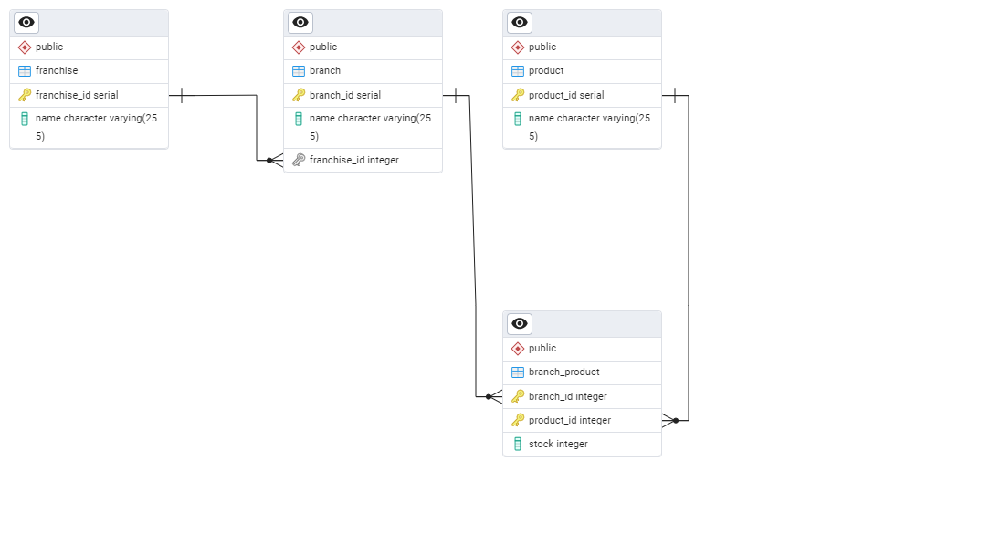

# Proyecto Base Implementando Clean Architecture

## Antes de Iniciar

Empezaremos por explicar los diferentes componentes del proyectos y partiremos de los componentes externos, continuando con los componentes core de negocio (dominio) y por �ltimo el inicio y configuraci�n de la aplicaci�n.

Lee el art�culo [Clean Architecture � Aislando los detalles](https://medium.com/bancolombia-tech/clean-architecture-aislando-los-detalles-4f9530f35d7a)

# Arquitectura


## Domain

Es el m�dulo m�s interno de la arquitectura, pertenece a la capa del dominio y encapsula la l�gica y reglas del negocio mediante modelos y entidades del dominio.

## Usecases

Este m�dulo gradle perteneciente a la capa del dominio, implementa los casos de uso del sistema, define l�gica de aplicaci�n y reacciona a las invocaciones desde el m�dulo de entry points, orquestando los flujos hacia el m�dulo de entities.

## Infrastructure

### Helpers

En el apartado de helpers tendremos utilidades generales para los Driven Adapters y Entry Points.

Estas utilidades no est�n arraigadas a objetos concretos, se realiza el uso de generics para modelar comportamientos
gen�ricos de los diferentes objetos de persistencia que puedan existir, este tipo de implementaciones se realizan
basadas en el patr�n de dise�o [Unit of Work y Repository](https://medium.com/@krzychukosobudzki/repository-design-pattern-bc490b256006)

Estas clases no puede existir solas y debe heredarse su compartimiento en los **Driven Adapters**

### Driven Adapters

Los driven adapter representan implementaciones externas a nuestro sistema, como lo son conexiones a servicios rest,
soap, bases de datos, lectura de archivos planos, y en concreto cualquier origen y fuente de datos con la que debamos
interactuar.

### Entry Points

Los entry points representan los puntos de entrada de la aplicaci�n o el inicio de los flujos de negocio.

## Application

Este m�dulo es el m�s externo de la arquitectura, es el encargado de ensamblar los distintos m�dulos, resolver las dependencias y crear los beans de los casos de use (UseCases) de forma autom�tica, inyectando en �stos instancias concretas de las dependencias declaradas. Adem�s inicia la aplicaci�n (es el �nico m�dulo del proyecto donde encontraremos la funci�n �public static void main(String[] args)�.

**Los beans de los casos de uso se disponibilizan automaticamente gracias a un '@ComponentScan' ubicado en esta capa.**


# Proyecto PRUEBA TECNICA de Franquicias

## Descripción
Este micro se implementa para manejar franquicias con sus debidas sucursales y tambien con los productos de las sucursales
los cuales tienen su stock, se realiza de forma basica pero con toda la estructura necesaria para garantizar un buen flujo inicial y exitoso

## Requisitos previos
Lista de herramientas y tecnologías que se deben tener instaladas antes de poder levantar el servicio.

- **Docker**: Asegúrate de tener Docker instalado. [Guía de instalación](https://docs.docker.com/get-docker/)
- **Docker Compose**: Asegúrate de tener Docker Compose instalado. [Guía de instalación](https://docs.docker.com/compose/install/)
- **Postman**: Asegúrate de tener Postman instalado. [Guía de instalación](https://www.postman.com/downloads/)
- **Java 17**: Asegúrate de tener Java 17 instalado.
- **CLI**: Asegurate de tener la cli de aws instalada y pues tambien una cuenta de aws todo esto con fines de despliegue en Cloud.

## Configuración de variables de entorno
Lista de las variables de entorno necesarias para configurar y levantar el servicio.

```bash
# variables de entorno 
DB_HOST=xxxxx
DB_PORT=xxxx
DB_USERNAME=xxxxx
DB_PASSWORD=xxxxxx
DB_NAME=xxxxxx
SCHEMA=xxxxxx
```
## RUTA DE ARCHIVOS SQL Y POSTMAN
```bash
  SQL para crear las tablas en la Base de datos

    nombre del archivo: SQL_DB (Se encuentra en raiz)
  
  POSTMAN para crear las tablas en la Base de datos

    nombre del archivo: Nequi-Test-Franchise.postman_collection (Se encuentra en raiz)
```

## ESQUEMA DE BASE DE DATOS





## DOCKERIZAR EL MICRO
Para dockerizar y probar el funcionamiento de este micro a nivel local se creo un archivo docker-compose y dockerfile los cuales se encuentran en deployment
esto con el fin de asignar las variables de entorno requeridas para la conexion a base de datos.
```bash
1 . TEST_Franchise_MS/deployment/docker-compose
2 . TEST_Franchise_MS/deployment/Dockerfile
```

## DESPLIEGUE EN NUBE AWS
Para desplegar esta solucion en cloud se necesitan los siguientes servicios de aws.

1. Repositorio ECR
2. VPC y Subnets
3. Security Groups
4. Application Load Balancer (ALB)
5. Target Group
6. ECS Cluster
7. ECS Service
8. Instancia RDS(Se encuentra desplegada en Nube con Terraform)

_NOTA: Todos estos servicios en este caso los creamos con Terraform los cuales
se encuentran en el siguiente REPO [IaC para TEST_Franchise_MS](https://github.com/Inge-David98/Franchise_Base_IaC)_


Para realizar el cargue de la imagen de docker, se deben seguir los siguientes pasos

## PASO 1
```bash
CONSTRUIR IMAGEN DOCKER

docker build -f deployment/Dockerfile -t {URI_ECR}:latest .
```
## PASO 2

```bash
AUTENTICAR DOCKER CON ECR

aws ecr get-login-password --region us-east-1 --profile dev-local | docker login --username AWS --password-stdin {URI_ECR}

```
## PASO 3

```bash
SUBIR IMAGEN A ECR

docker push {URI_ECR}:latest
```

## EXPLICACION DE LA IAC [IaC para TEST_Franchise_MS](https://github.com/Inge-David98/Franchise_Base_IaC)

Esta IaC se hizo con la finalidad de entregar una solucion montada en Cloud, donde en realidad se creo un archivo
main.tf, y alli se crearon todos los Scripts HCL que son necesarios para levantar el micro-servicio

_Nota: no se aplicaron inputs, tfvars, outputs, datas, locals y modules, loc cuales son herramientas de terraform, debido al tiempo de entrega de la solucion
sin embargo cabe aclarar que aplicar todos estos conceptos en la IaC nos facilita la administracion de la creacion y despliegue de recursos
seria una mejora a futuro para esta IaC_


