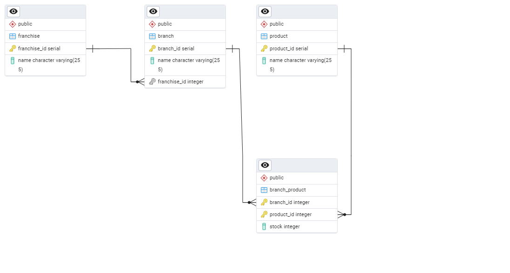

# Microservicio de Franquicias - Clean Architecture

## Descripción
Este microservicio implementa un sistema de gestión de franquicias con sus sucursales y productos, incluyendo manejo de stock. Está desarrollado siguiendo los principios de Clean Architecture.

## Guía de Inicio Rápido

### 1. Clonar el repositorio
```bash
git clone <repository-url>
cd TEST_Franchise_MS
```

### 2. Configurar base de datos
Ejecuta el script SQL para crear las tablas:
```bash
# El archivo SQL_DB.sql contiene las tablas necesarias
psql -h <host> -U <username> -d <database> -f SQL_DB.sql
```

### 3. Ejecutar localmente

#### Opción A: Con Docker (Recomendado)
```bash
# 1. Construir la aplicación
./gradlew build

# 2. Construir imagen Docker
docker build -f deployment/Dockerfile -t franchise:v1 .

# 3. Configurar variables en deployment/docker-compose.yml
# 4. Ejecutar
docker-compose -f deployment/docker-compose.yml up
```

#### Opción B: Directamente con Gradle
```bash
# Configurar variables de entorno y ejecutar
export DB_HOST=localhost
export DB_PORT=5432
export DB_USERNAME=tu_usuario
export DB_PASSWORD=tu_password
export DB_NAME=tu_base_datos
export SCHEMA=public

./gradlew bootRun
```

### 4. Probar la API
Importa la colección de Postman: `Nequi-Test-Franchise.postman_collection.json`

La aplicación estará disponible en: http://localhost:8080

---

## Arquitectura del Proyecto

Lee el artículo [Clean Architecture - Aislando los detalles](https://medium.com/bancolombia-tech/clean-architecture-aislando-los-detalles-4f9530f35d7a)


## Domain

Es el módulo más interno de la arquitectura, pertenece a la capa del dominio y encapsula la lógica y reglas del negocio mediante modelos y entidades del dominio.

## Usecases

Este módulo gradle perteneciente a la capa del dominio, implementa los casos de uso del sistema, define lógica de aplicación y reacciona a las invocaciones desde el módulo de entry points, orquestando los flujos hacia el módulo de entities.

## Infrastructure

### Helpers

En el apartado de helpers tendremos utilidades generales para los Driven Adapters y Entry Points.

Estas utilidades no están arraigadas a objetos concretos, se realiza el uso de generics para modelar comportamientos
genéricos de los diferentes objetos de persistencia que puedan existir, este tipo de implementaciones se realizan
basadas en el patrón de diseño [Unit of Work y Repository](https://medium.com/@krzychukosobudzki/repository-design-pattern-bc490b256006)

Estas clases no puede existir solas y debe heredarse su comportamiento en los **Driven Adapters**

### Driven Adapters

Los driven adapter representan implementaciones externas a nuestro sistema, como lo son conexiones a servicios rest,
soap, bases de datos, lectura de archivos planos, y en concreto cualquier origen y fuente de datos con la que debamos
interactuar.

### Entry Points

Los entry points representan los puntos de entrada de la aplicación o el inicio de los flujos de negocio.

## Application

Este módulo es el más externo de la arquitectura, es el encargado de ensamblar los distintos módulos, resolver las dependencias y crear los beans de los casos de use (UseCases) de forma automática, inyectando en éstos instancias concretas de las dependencias declaradas. Además inicia la aplicación (es el único módulo del proyecto donde encontraremos la función public static void main(String[] args).

**Los beans de los casos de uso se disponibilizan automaticamente gracias a un '@ComponentScan' ubicado en esta capa.**

---

## Requisitos Previos

### Obligatorios
- **Java 17**: [Descargar OpenJDK 17](https://adoptium.net/)
- **PostgreSQL**: Base de datos (local o remota)
- **Git**: Para clonar el repositorio

### Opcionales (pero recomendados)
- **Docker & Docker Compose**: [Guía de instalación](https://docs.docker.com/get-docker/)
- **Postman**: [Descargar](https://www.postman.com/downloads/) para probar la API

### Para despliegue en AWS
- **AWS CLI**: [Guía de instalación](https://docs.aws.amazon.com/cli/latest/userguide/getting-started-install.html)
- **Cuenta de AWS** con permisos para ECR, ECS, RDS

## Variables de Entorno

### Variables requeridas para la base de datos:
```bash
DB_HOST=localhost          # Host de la base de datos
DB_PORT=5432              # Puerto de PostgreSQL (por defecto 5432)
DB_USERNAME=tu_usuario    # Usuario de la base de datos
DB_PASSWORD=tu_password   # Contraseña de la base de datos
DB_NAME=franchise_db      # Nombre de la base de datos
SCHEMA=public            # Esquema de la base de datos
```

### Configuración en diferentes entornos:

#### Para Docker Compose:
Edita el archivo `deployment/docker-compose.yml` con tus valores reales.

#### Para ejecución local:
```bash
# Linux/Mac
export DB_HOST=localhost
export DB_PORT=5432
# ... resto de variables

# Windows
set DB_HOST=localhost
set DB_PORT=5432
# ... resto de variables
```

## Archivos Importantes

### Base de Datos
- **SQL_DB.sql**: Script para crear las tablas necesarias (ubicado en la raíz del proyecto)
- Ejecutar antes de iniciar la aplicación:
  ```bash
  psql -h <host> -U <username> -d <database> -f SQL_DB.sql
  ```

### Testing
- **Nequi-Test-Franchise.postman_collection.json**: Colección de Postman con todos los endpoints
- Importar en Postman para probar la API

### Esquema de Base de Datos
Ver archivo `Schema.png` para el diagrama ER completo.



## Ejecución con Docker

### Pasos para ejecutar localmente:

1. **Construir la aplicación:**
   ```bash
   ./gradlew build
   ```

2. **Construir imagen Docker:**
   ```bash
   docker build -f deployment/Dockerfile -t franchise:v1 .
   ```

3. **Configurar variables de entorno:**
   Edita `deployment/docker-compose.yml` con tus credenciales de base de datos.

4. **Ejecutar:**
   ```bash
   docker-compose -f deployment/docker-compose.yml up
   ```

### Archivos Docker:
- `deployment/Dockerfile`: Configuración de la imagen
- `deployment/docker-compose.yml`: Orquestación del servicio

## Despliegue en AWS

Para desplegar esta solución en cloud se necesitan los siguientes servicios de AWS:

1. Repositorio ECR
2. VPC y Subnets
3. Security Groups
4. Application Load Balancer (ALB)
5. Target Group
6. ECS Cluster
7. ECS Service
8. Instancia RDS (Se encuentra desplegada en Nube con Terraform)

**NOTA:** Todos estos servicios se crean con Terraform en el repositorio [IaC para TEST_Franchise_MS](https://github.com/Inge-David98/IaC_Modules)

### Pasos para despliegue en AWS:

1. **Construir imagen Docker:**
   ```bash
   ./gradlew build
   docker build -f deployment/Dockerfile -t {URI_ECR}:latest .
   ```

2. **Autenticar Docker con ECR:**
   ```bash
   aws ecr get-login-password --region us-east-1 | docker login --username AWS --password-stdin {URI_ECR}
   ```

3. **Subir imagen a ECR:**
   ```bash
   docker push {URI_ECR}:latest
   ```

**Nota:** Reemplaza `{URI_ECR}` con la URI real de tu repositorio ECR.

## Infraestructura como Código (IaC)

### Repositorio de Terraform
[IaC para TEST_Franchise_MS](https://github.com/Inge-David98/IaC_Modules)

### Recursos AWS creados:
- Repositorio ECR para imágenes Docker
- VPC y Subnets para networking
- Security Groups para seguridad
- Application Load Balancer (ALB)
- Target Groups
- ECS Cluster y Service
- Instancia RDS para PostgreSQL

### Mejoras futuras:
- Implementar módulos de Terraform
- Usar variables (tfvars)
- Agregar outputs
- Implementar data sources y locals

---

## Solución de Problemas

### Errores comunes:

1. **Error de conexión a base de datos:**
   - Verificar que PostgreSQL esté ejecutándose
   - Confirmar credenciales en variables de entorno
   - Verificar conectividad de red

2. **Puerto 8080 ocupado:**
   ```bash
   # Cambiar puerto en docker-compose.yml
   ports:
     - "8081:8080"  # Usar puerto 8081 localmente
   ```

3. **Error al construir con Gradle:**
   ```bash
   # Limpiar y reconstruir
   ./gradlew clean build
   ```

4. **Problemas con permisos en gradlew:**
   ```bash
   chmod +x gradlew
   ```

## Endpoints Principales

La aplicación expone los siguientes endpoints (ver colección de Postman para detalles):

- **Franquicias**: CRUD de franquicias
- **Sucursales**: CRUD de sucursales por franquicia
- **Productos**: CRUD de productos
- **Stock**: Gestión de inventario por sucursal

## Contribución

Para contribuir al proyecto:
1. Fork del repositorio
2. Crear rama feature
3. Commit de cambios
4. Push a la rama
5. Crear Pull Request

## Licencia

Este proyecto es una prueba técnica para demostrar implementación de Clean Architecture con Spring Boot y PostgreSQL.